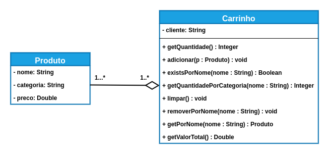

# Exercício Relacionamento 📎

## Orientações Gerais: 🚨
1. Utilize **apenas** tipos **wrapper** para criar atributos e métodos.
2. **Respeite** os nomes de atributos e métodos definidos no exercício.
3. Tome **cuidado** com os **argumentos** especificados no exercício.
   **Não** adicione argumentos não solicitados e mantenha a ordem definida no enunciado.
4. Verifique se **não** há **erros de compilação** no projeto antes de enviar.
5. As classes devem seguir as regras de encapsulamento.
6. Deixe um **construtor vazio** para utilização nos testes unitários.

## Carrinho 

Implemente o seguinte diagrama de classes:

### Métodos da classe `Produto`:

* Deve conter todos os getters e setters

### Métodos da classe `Carrinho`

- `Double getQuantidade()`:

  * **Retorna** a quantidade de `Produtos` incluídos no `Carrinho`

- `void adicionar(Produto produto)`:
  * Adiciona o produto recebido na lista de produtos

- `Boolean existsPorNome(String nome)`:
  * **Retorna** se um produto existe dentro do `Carrinho` pelo nome
  * Deve ignorar letras maiúsculas e minúsculas (Case Insensitive)

  

- `Integer getQuantidadePorCategoria(String categoria)`:
  * **Retorna** a quantidade produtos de uma determinada categoria

  

- `void limpar()`
  * Remove todos os produtos do carrinho

  
- `void removerPorNome(String nome)`
  * Remove um produto de dentro do carrinho a partir do nome
  * Deve ignorar letras maiúsculas e minúsculas (Case Insensitive)

- `void getPorNome(String nome)`
  * **Retorna** o produto do carrinho a partir do nome
  * Caso o produto não seja encontrado retorne null
  * Deve ignorar letras maiúsculas e minúsculas (Case Insensitive)

- `Double getValorTotal()`
  * **Retorna** a soma dos preços de todos os produtos
